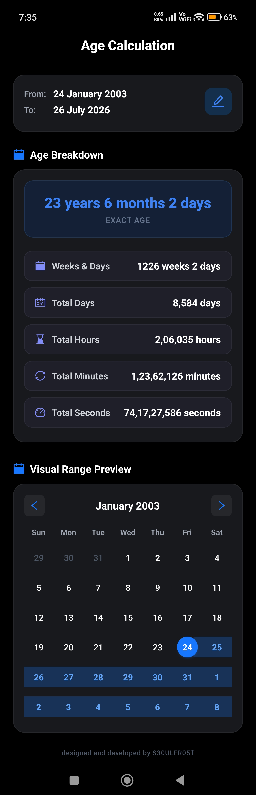

# ⏳ Age Calculator App

A modern, high-performance, dark-themed React Native / Expo mobile application designed to calculate exact age breakdowns with fluid animations and a visual range calendar preview.

---

## 📱 Screenshots

<div align="center">
  
  &nbsp;&nbsp;&nbsp;&nbsp;
  
</div>

---

## ✨ Features

- 🎯 **Exact Age Calculation**: Accurately calculates age in years, months, and days.
- 📊 **Comprehensive Breakdown**: Displays detailed metrics including:
  - Total Weeks & Remaining Days
  - Total Days
  - Total Hours
  - Total Minutes
  - Total Seconds
- 📅 **Visual Range Calendar Preview**: Interactive custom calendar highlighting the start date, end date, and range span.
- 🎨 **Sleek Dark Mode Design**: Minimalist pitch-black interface with blue & purple accents designed for maximum visual comfort.
- ⚡ **Fluid Micro-Animations**: Smooth morphing card transitions and button press scaling powered by `react-native-reanimated`.
- 📱 **Dynamic Safe-Area & Hardware Back Support**: Automatically adapts footer positioning for Android 3-button & gesture navigation bars, and supports native Android hardware back button navigation.

---

## 🛠️ Tech Stack

- **Framework**: [React Native](https://reactnative.dev/) with [Expo (v54)](https://expo.dev/)
- **Routing**: [Expo Router](https://docs.expo.dev/router/introduction/) (File-based navigation)
- **Language**: [TypeScript](https://www.typescriptlang.org/)
- **Animations**: [React Native Reanimated](https://docs.swmansion.com/react-native-reanimated/)
- **Date Handling**: [Day.js](https://day.js.org/)
- **UI Components**: [@ant-design/react-native](https://rn.ant.design/) & [@expo/vector-icons](https://icons.expo.fyi/)
- **Safe Area Management**: [react-native-safe-area-context](https://github.com/th3rdwave/react-native-safe-area-context)

---

## 🚀 Getting Started

### Prerequisites

- [Node.js](https://nodejs.org/) (v18 or higher)
- [npm](https://www.npmjs.com/) or [yarn](https://yarnpkg.com/)
- [Expo Go](https://expo.dev/go) app on your mobile device OR Android Emulator / iOS Simulator

### Installation

1. **Clone the repository**:
   ```bash
   git clone https://github.com/S30ULFR05T/age-calculator.git
   cd age-calculator
   ```

2. **Install dependencies**:
   ```bash
   npm install
   ```

3. **Start the Expo development server**:
   ```bash
   npx expo start
   ```

4. **Run on device/emulator**:
   - Scan the QR code with **Expo Go** (Android) or **Camera** (iOS).
   - Press `a` to launch in an Android Emulator.
   - Press `i` to launch in an iOS Simulator.

---

## 🧑‍💻 Author

Designed and developed with ❤️ by **[S30ULFR05T](https://github.com/S30ULFR05T)**.

---

## 📄 License

This project is open-source and available under the [MIT License](LICENSE).
